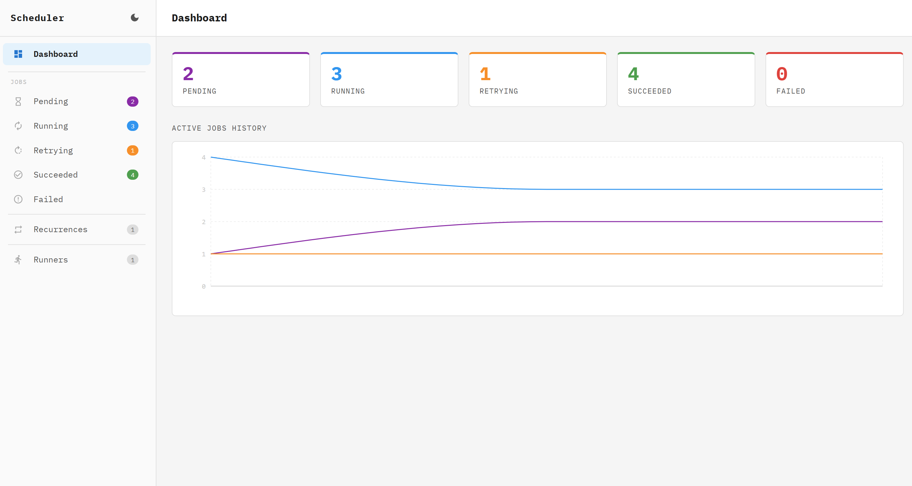
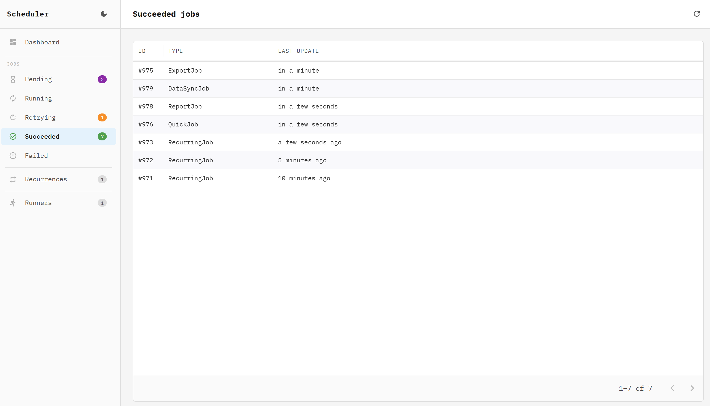
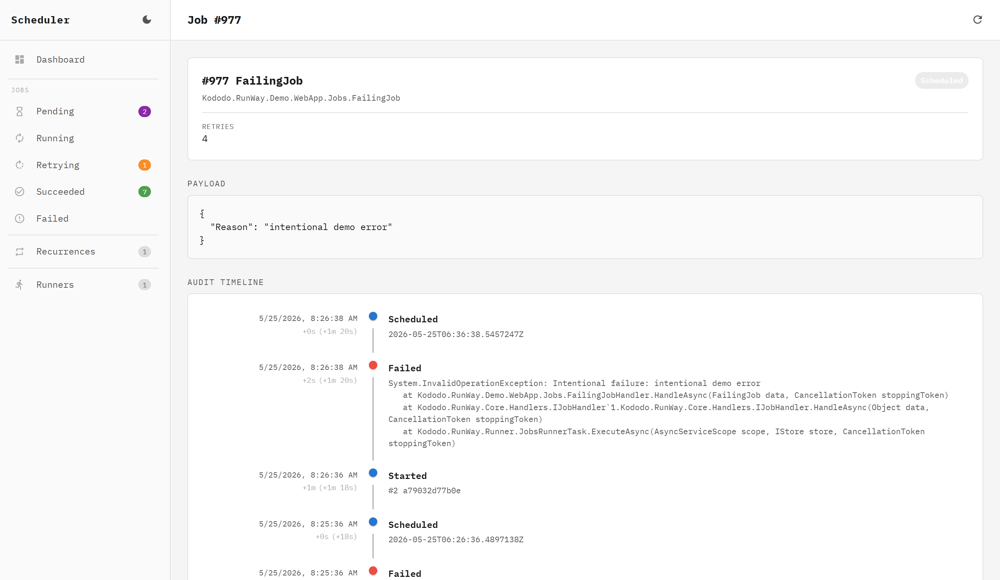

# RunWay

[](https://github.com/kododo-dev/RunWay/actions/workflows/ci.yml)
[](https://kododo.dev/runway/demo)

Lightweight, persistent background job queue for .NET. Supports priority scheduling, automatic retries, timeout enforcement, outbox pattern integration, and a built-in web dashboard.

A live demo is available at [kododo.dev/runway/demo](https://kododo.dev/runway/demo).

## Packages

| Package | NuGet | Description |
|---|---|---|
| `Kododo.RunWay` | [](https://www.nuget.org/packages/Kododo.RunWay) | Core library — DI registration and job scheduling |
| `Kododo.RunWay.Core` | [](https://www.nuget.org/packages/Kododo.RunWay.Core) | Abstractions and interfaces (for extension authors) |
| `Kododo.RunWay.Runner` | [](https://www.nuget.org/packages/Kododo.RunWay.Runner) | Background worker — processes jobs |
| `Kododo.RunWay.Dashboard` | [](https://www.nuget.org/packages/Kododo.RunWay.Dashboard) | Embedded web dashboard |
| `Kododo.RunWay.PostgreSQL` | [](https://www.nuget.org/packages/Kododo.RunWay.PostgreSQL) | PostgreSQL storage provider |

## Quick start

### 1. Install packages

```bash
dotnet add package Kododo.RunWay
dotnet add package Kododo.RunWay.Runner
dotnet add package Kododo.RunWay.PostgreSQL
dotnet add package Kododo.RunWay.Dashboard     # optional
```

### 2. Define a job and its handler

```csharp
public class SendEmailJob
{
    public required string To      { get; set; }
    public required string Subject { get; set; }
}

public class SendEmailJobHandler : IJobHandler<SendEmailJob>
{
    public async Task HandleAsync(SendEmailJob data, CancellationToken stoppingToken)
    {
    }
}
```

### 3. Register RunWay

```csharp
builder.Services.AddRunWay(x =>
{
    x.UsePostgreSQL(p => p.GetRequiredService<AppDbContext>().Database.GetDbConnection())
     .AddRunner(opts => opts.AddHandlersFromAssembly(typeof(Program).Assembly))
     .AddDashboard();
});
```

### 4. Schedule a job

```csharp
public class OrderService(IScheduler scheduler)
{
    public async Task PlaceOrderAsync(Order order, CancellationToken ct)
    {
        await scheduler
            .Job(new SendEmailJob { To = order.Email, Subject = "Order confirmed" })
            .ScheduleAsync(ct);
    }
}
```

### 5. Mount the dashboard

```csharp
app.UseRunWayDashboard();  // available at /scheduler
```

---

## Scheduling options

```csharp
await scheduler
    .Job(new SendEmailJob { To = "user@example.com", Subject = "Hello" })
    .WithPriority(10)                          // higher = processed first (default: 0)
    .WithRetryDelaysInSeconds(10, 60, 300)     // retry after 10s, 60s, 5min
    .WithTimeout(TimeSpan.FromMinutes(5))      // fail job if it exceeds this duration
    .ScheduleAsync(ct);

// Schedule for a future time
await scheduler
    .Job(new ReminderJob { Message = "Don't forget!" })
    .ScheduleAsync(DateTimeOffset.UtcNow.AddHours(2), ct);
```

---

## Recurring jobs

Register recurring jobs using standard 5-field cron expressions. Shorthand like `*/5 * * * *` is stored as-is, not expanded.

```csharp
await app.SetRecurrenceAsync("hourly-report", "0 * * * *", new GenerateReportJob { ReportType = "hourly" });

await app.SetRecurrenceAsync("health-check", "*/5 * * * *", new HealthCheckJob());

await app.SetRecurrenceAsync("nightly-cleanup", "0 2 * * *", new CleanupJob(), opts =>
{
    opts.WithTimeout(TimeSpan.FromMinutes(30))
        .WithRetryDelaysInSeconds(60, 300);
});
```

- Safe to call on every startup — only updates if the expression or data changed
- Each recurrence is identified by a unique string key

---

## Outbox pattern

RunWay supports the outbox pattern — you can enlist job creation in your existing database transaction, guaranteeing atomicity between your business data and the scheduled job.

```csharp
await using var transaction = await db.Database.BeginTransactionAsync();

db.Orders.Add(new Order { ... });
await db.SaveChangesAsync();

// AsTransactional(false) — reuse the ambient transaction instead of opening a new one
await scheduler
    .Job(new SendEmailJob { To = "user@example.com", Subject = "Order confirmed" })
    .AsTransactional(false)
    .ScheduleAsync(ct);

// Both the order and the job are committed or rolled back together
await transaction.CommitAsync();
```

For this to work, RunWay must share the same database connection as your `DbContext`:

```csharp
x.UsePostgreSQL(p => p.GetRequiredService<AppDbContext>().Database.GetDbConnection())
```

---

## Runner configuration

```csharp
.AddRunner(opts =>
{
    opts.ThreadsCount      = 4;                                 // parallel processing threads (default: processor count)
    opts.Interval          = TimeSpan.FromSeconds(5);           // polling interval when queue is empty (default: 5s)
    opts.HeartbeatInterval = TimeSpan.FromSeconds(30);          // keep-alive signal interval (default: 30s)
    opts.HeartbeatTimeout  = TimeSpan.FromMinutes(2);           // runner considered offline after this time (default: 2min)
    opts.DeleteSucceededAfterTimeSpan = TimeSpan.FromHours(24); // auto-delete succeeded jobs (default: disabled)
})
```

---

## Dashboard

Mount the dashboard in your ASP.NET Core pipeline:

```csharp
// Default path: /scheduler
app.UseRunWayDashboard();

// Custom path
app.UseRunWayDashboard("/jobs/dashboard");

// With authorization
app.UseRunWayDashboard()
   .RequireAuthorization(policy => policy.RequireRole("Admin"));
```

The dashboard shows job counts by status, a paginated job list, per-job audit timeline, recurring job schedules, and runner health.







---

## Requirements

- .NET 8, 9, or 10
- PostgreSQL 12 or later (additional storage providers coming soon)

## License

MIT
